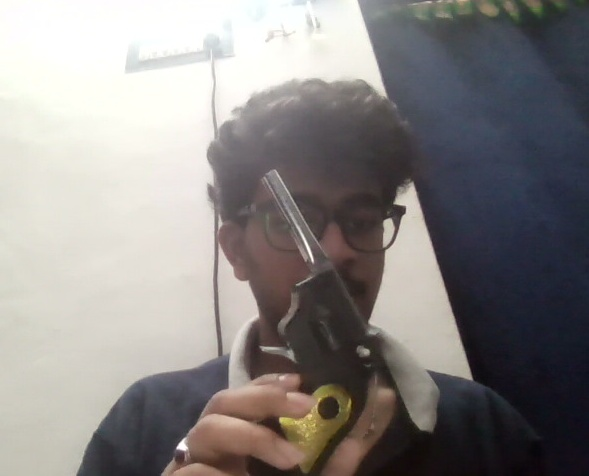
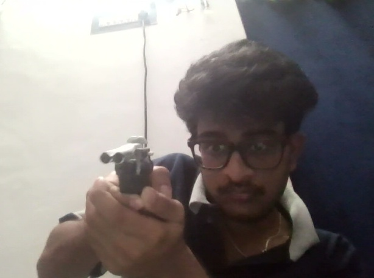
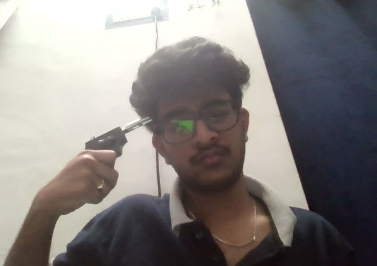
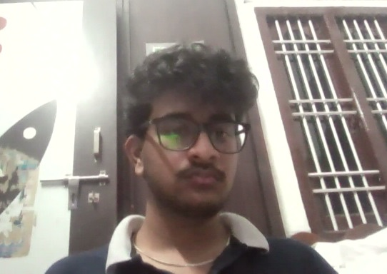
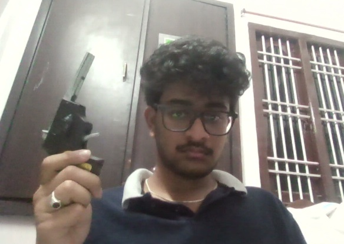
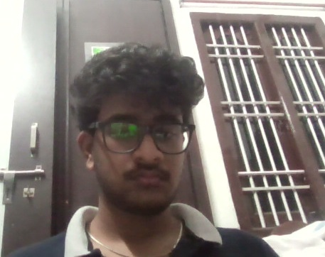
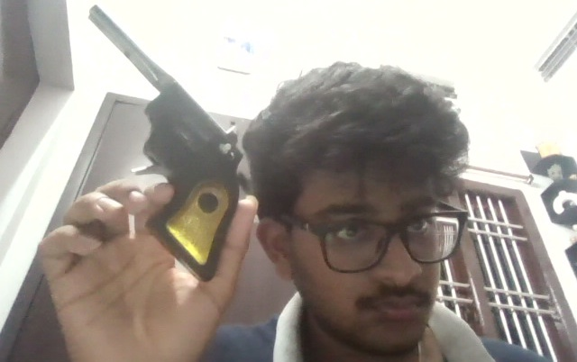
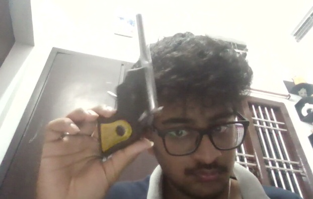

# 🔴 Security Camera Weapon Detection System

A real-time AI-powered security camera system that detects weapons (pistols, knives, rifles, grenades) using your webcam or IP camera. When a weapon is detected, it automatically:
- 📸 Takes a snapshot of the person
- 🎥 Records a video clip
- 📧 Sends an email alert with photo
- 📱 Sends an SMS (via Twilio)
- 🤖 Sends a Telegram alert with photo
- 🔊 Plays an alarm sound
- 🌐 Shows everything on a live web dashboard

---

## 📸 Real Detection Screenshots

These are actual detections captured by the system:

| Pistol Detection | Knife Detection |
|:---:|:---:|
|  |  |
|  |  |
|  |  |
|  |  |

---

## 🧠 How It Works (Simple Explanation)

```
Your Webcam
    │
    ▼
┌─────────────────────────────────────────────┐
│  Frame captured every ~33ms                 │
│                                             │
│  1. Night Mode (auto-brighten if dark)      │
│  2. Face Detection  (built-in OpenCV)       │
│  3. Person Detection  (YOLOv8 — local)      │
│  4. Weapon Detection  (Roboflow AI — cloud) │
└─────────────────────────────────────────────┘
    │
    ▼  Weapon found with confidence ≥ 35%
    │  AND detected in 3+ consecutive frames?
    │
    ▼
┌─────────────────────────────────────────────┐
│  Alert Pipeline (all run in background)     │
│                                             │
│  📸 Save person snapshot                   │
│  🎥 Record 10-second video clip            │
│  🔊 Play alarm beep                        │
│  📧 Send email with photo                  │
│  📱 Send SMS                               │
│  🤖 Send Telegram message + photo          │
│  💾 Log to SQLite database                 │
└─────────────────────────────────────────────┘
    │
    ▼
🌐 Web Dashboard at http://localhost:5000
   (live camera feed + alert history table)
```

---

## 📁 Project Structure

```
Security_cam/
│
├── main.py              ← Run this to start the system
├── config.py            ← ALL your settings go here
│
├── detector.py          ← Sends frames to Roboflow AI for weapon detection
├── dashboard.py         ← Flask web dashboard (live feed + alert log)
├── database.py          ← SQLite database (stores all alerts)
├── emailer.py           ← Sends email alerts with photo attached
├── sms_alert.py         ← Sends SMS via Twilio
├── telegram_alert.py    ← Sends Telegram alerts with photo
├── snapshot.py          ← Saves person photo + records video clip
├── alarm.py             ← Plays beep alarm sound
├── scheduler.py         ← Limits active hours + sends daily report
│
├── yolov8n.pt           ← YOLOv8 model (person detection, runs locally)
├── security_log.db      ← Auto-created SQLite database
├── snapshots/           ← Auto-created folder for saved photos
└── videos/              ← Auto-created folder for saved video clips
```

---

## ✅ Requirements

- Python 3.8 or higher
- A webcam (built-in laptop cam works fine)
- A free [Roboflow](https://roboflow.com) account (for weapon detection AI)
- Optional: Gmail account, Twilio account, Telegram bot

---

## 🚀 Quick Start (Step by Step)

### Step 1 — Clone the Repository

```bash
git clone https://github.com/YOUR_USERNAME/Security_cam.git
cd Security_cam
```

### Step 2 — Install Python Dependencies

```bash
pip install opencv-python ultralytics flask requests numpy
```

If you want SMS alerts, also install:
```bash
pip install twilio
```

### Step 3 — Get Your Roboflow API Key (FREE)

This is the AI engine that detects weapons. It's free to use.

1. Go to [https://roboflow.com](https://roboflow.com) and create a free account
2. After logging in, click your profile icon → **Settings** → **API Keys**
3. Copy your **Private API Key**

### Step 4 — Edit `config.py`

Open `config.py` and fill in your details:

```python
# ── Roboflow (REQUIRED) ────────────────────────
ROBOFLOW_API_KEY  = "paste_your_api_key_here"   # ← Your Roboflow API key
ROBOFLOW_MODEL    = "weapon-detection-f1lih/1"  # ← Keep this as-is

# ── Email (OPTIONAL) ──────────────────────────
EMAIL_SENDER    = "your_gmail@gmail.com"         # ← Your Gmail address
EMAIL_PASSWORD  = "your_app_password"            # ← Gmail App Password (not your real password)
EMAIL_RECEIVERS = ["recipient@gmail.com"]        # ← Who gets alerts

# ── Camera ────────────────────────────────────
CAMERA_INDEXES = [0]   # ← 0 = built-in webcam, 1 = second camera
```

> **For EMAIL_PASSWORD**: Gmail requires an "App Password" (not your normal password).
> Go to your Google Account → Security → 2-Step Verification → App Passwords → Generate one.

### Step 5 — Run the System

```bash
python main.py
```

You will see:
```
[DB] Initialized.
[INFO] Loading person detection model...
[DETECTOR] Background detection thread started.
[DASHBOARD] Running at http://localhost:5000
[INFO] Starting 1 camera(s)...
[INFO] Dashboard → http://localhost:5000
[INFO] Press Q in any camera window to quit.
[CAM 0] Opened.
```

- A **camera window** will open showing the live feed with detection boxes
- Open your browser at **http://localhost:5000** for the web dashboard
- Press **Q** in the camera window to quit

---

## ⚙️ All Settings Explained (`config.py`)

### Email Settings
```python
EMAIL_SENDER    = "you@gmail.com"       # Gmail that sends alerts
EMAIL_PASSWORD  = "xxxx xxxx xxxx xxxx" # Gmail App Password
EMAIL_RECEIVERS = ["person@gmail.com"]  # Can add multiple recipients
SMTP_HOST       = "smtp.gmail.com"      # Leave as-is for Gmail
SMTP_PORT       = 587                   # Leave as-is
```

### SMS Settings (Twilio)
```python
TWILIO_ENABLED = False          # Change to True to enable
TWILIO_SID     = "ACxxx..."     # From your Twilio dashboard
TWILIO_AUTH    = "your_token"   # From your Twilio dashboard
TWILIO_FROM    = "+1xxxxxxxxxx" # Your Twilio phone number
TWILIO_TO      = ["+91xxxxxxx"] # Recipients (any country)
```

### Telegram Settings
```python
TELEGRAM_ENABLED  = False           # Change to True to enable
TELEGRAM_TOKEN    = "123:ABCxxx"    # From @BotFather on Telegram
TELEGRAM_CHAT_IDS = ["123456789"]   # Your chat ID (use @userinfobot)
```

> **How to get a Telegram Bot Token:**
> 1. Open Telegram, search for `@BotFather`
> 2. Send `/newbot` and follow instructions
> 3. Copy the token it gives you

### Camera Settings
```python
CAMERA_INDEXES = [0]      # [0] = webcam, [0, 1] = two cameras
FRAME_WIDTH    = 640      # Resolution width
FRAME_HEIGHT   = 480      # Resolution height
AUTO_RECONNECT = True     # Auto-reconnect if camera disconnects
NIGHT_MODE     = False    # Auto-brighten in dark environments
```

### Detection Settings
```python
CONFIDENCE        = 0.35  # Minimum confidence (0.0–1.0). Lower = more sensitive
ALERT_COOLDOWN    = 30    # Seconds to wait before re-alerting for same weapon
MIN_DETECT_FRAMES = 3     # Weapon must appear in 3 consecutive frames (reduces false alarms)
MOTION_DETECTION  = True  # Only call AI when motion is detected (saves API calls)
MOTION_THRESHOLD  = 5000  # Motion sensitivity — lower number = more sensitive
```

### Video & Alarm
```python
SAVE_VIDEO_CLIP    = True  # Save a video clip when weapon detected
VIDEO_CLIP_SECONDS = 10    # Length of video clip in seconds
ALARM_ENABLED      = True  # Beep sound when weapon detected
ALARM_DURATION     = 3     # How long the alarm beeps (seconds)
```

### Schedule (only run at certain hours)
```python
SCHEDULE_ENABLED    = False  # True = only run during set hours
SCHEDULE_START_HOUR = 22     # 10 PM
SCHEDULE_END_HOUR   = 6      # 6 AM (supports overnight schedules)
```

### Daily Report
```python
DAILY_REPORT_ENABLED = True  # Send a summary email every day
DAILY_REPORT_HOUR    = 8     # Send at 8 AM
```

### Weapon Classes
```python
WEAPON_CLASSES = {"pistol", "knife", "rifle", "grenade", "missile"}
# These are the labels the AI model can detect
```

---

## 🌐 Web Dashboard

Open **http://localhost:5000** in your browser after starting the system.

**Features:**
- 📷 Live camera feed(s) with real-time video stream
- 📋 Alert log table showing all detections
- 🟢 Live indicator — auto-refreshes every 3 seconds (no page reload needed)
- Shows: ID, Time, Camera, Weapon type, Snapshot path, Email/SMS/Telegram status

---

## 🗄️ View Saved Alerts (Database)

To print all logged alerts in the terminal:

```bash
python database.py
```

Output example:
```
ID    Time                   Cam   Weapon       Snapshot
----------------------------------------------------------------------
3     2026-03-01 22:04:58    0     pistol       snapshots/pistol_20260301_220449.jpg
2     2026-03-01 22:04:49    0     knife        snapshots/knife_20260301_220449.jpg
1     2026-03-01 21:12:28    0     pistol       snapshots/pistol_20260301_211228.jpg

Total alerts: 3
```

---

## 🔧 Troubleshooting

### Camera not opening
```
[CAM 0] Opened.   ← Good
```
If it doesn't open, try `CAMERA_INDEXES = [1]` in `config.py` (some laptops use index 1).

### No weapon detections
- Make sure `ROBOFLOW_API_KEY` is set correctly in `config.py`
- Check your internet connection (Roboflow runs in the cloud)
- Lower the confidence: `CONFIDENCE = 0.25`
- Lower MIN_DETECT_FRAMES: `MIN_DETECT_FRAMES = 1` (more sensitive, more false alarms)

### Email not sending
- Make sure you are using a **Gmail App Password**, NOT your regular password
- Enable 2-Step Verification on your Google account first
- Check that `EMAIL_SENDER` and `EMAIL_PASSWORD` are correct

### `ModuleNotFoundError`
Install missing packages:
```bash
pip install opencv-python ultralytics flask requests numpy
```

### Dashboard not loading
Make sure port 5000 is not already in use. You can change the port in `dashboard.py`:
```python
app.run(host="0.0.0.0", port=5001, ...)  # change to any free port
```

---

## 📦 Full Dependency List

| Package | Purpose | Install |
|---|---|---|
| `opencv-python` | Camera capture, face detection, drawing boxes | `pip install opencv-python` |
| `ultralytics` | YOLOv8 person detection (runs locally) | `pip install ultralytics` |
| `flask` | Web dashboard server | `pip install flask` |
| `requests` | Roboflow API calls, Telegram API calls | `pip install requests` |
| `numpy` | Image processing (motion detection) | `pip install numpy` |
| `twilio` | SMS alerts (optional) | `pip install twilio` |

All at once:
```bash
pip install opencv-python ultralytics flask requests numpy twilio
```

---

## 🔑 API Keys Summary

| Service | Required? | Where to get it | Config key |
|---|---|---|---|
| Roboflow | **YES** | [roboflow.com](https://roboflow.com) → Settings → API Keys | `ROBOFLOW_API_KEY` |
| Gmail App Password | Optional | Google Account → Security → App Passwords | `EMAIL_PASSWORD` |
| Twilio | Optional | [twilio.com](https://twilio.com) → Console | `TWILIO_SID`, `TWILIO_AUTH` |
| Telegram Bot | Optional | Telegram → @BotFather → /newbot | `TELEGRAM_TOKEN` |

---

## 🖥️ Multiple Cameras

To use 2 cameras simultaneously:

```python
# config.py
CAMERA_INDEXES = [0, 1]   # runs both cameras in separate threads
```

Each camera gets its own window and its own feed in the dashboard.

---

## 📂 Output Files

| Type | Location | Example |
|---|---|---|
| Snapshots | `snapshots/` | `snapshots/pistol_20260301_211228.jpg` |
| Video clips | `videos/` | `videos/knife_20260301_215628.avi` |
| Database | `security_log.db` | SQLite, view with `python database.py` |

---

## ⚡ Quick Command Reference

```bash
# Start the system
python main.py

# View all logged alerts
python database.py

# Run only the dashboard (to view existing logs)
python dashboard.py
```

---

## 🛡️ Legal & Ethical Notice

This system is intended for **legitimate security monitoring** on property you own or have permission to monitor. Always comply with local privacy laws and regulations regarding surveillance. Do not use this system to monitor people without their knowledge where prohibited by law.

---

## 🤝 Contributing

Pull requests are welcome. For major changes, open an issue first to discuss what you'd like to change.

---

*Built with OpenCV, YOLOv8, Roboflow, Flask, and Python.*
